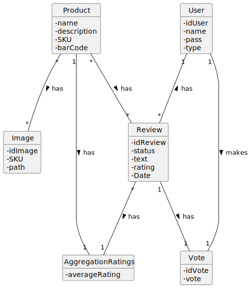

# OO Analysis #

The construction process of the domain model is based on the client specifications, especially the nouns (for _concepts_) and verbs (for _relations_) used. 

## Rationale to identify domain conceptual classes ##
 

### _Conceptual Class Category List_ ###

**Business Transactions**

*

---

**Transaction Line Items**

*

---

**Product/Service related to a Transaction or Transaction Line Item**

*  

---

**Transaction Records**

*  

---  

**Roles of People or Organizations**

* 
* 
* 
* 

---

**Places**

*  

---

**Noteworthy Events**

* 

---

**Physical Objects**

* 
* 
---

**Descriptions of Things**

* 
* 
* 
* 

---

**Catalogs**

*  

---

**Containers**

*  

---

**Elements of Containers**

*  

---

**Organizations**

*  

---

**Other External/Collaborating Systems**

*  

---

**Records of finance, work, contracts, legal matters**

* 

---

**Financial Instruments**

*  

---

**Documents mentioned/used to perform some work/**

* 
---

###**Rationale to identify associations between conceptual classes**

| Concept (A) 		|  Association   	|  Concept (B) |
|----------	   		|:-------------:		|------:       |
|  	         |    		 	|   |
|   	|     		 	|   |
|  	|    		 	|  |
|  	|     		 	|   |
| |  | |

## Domain Model

