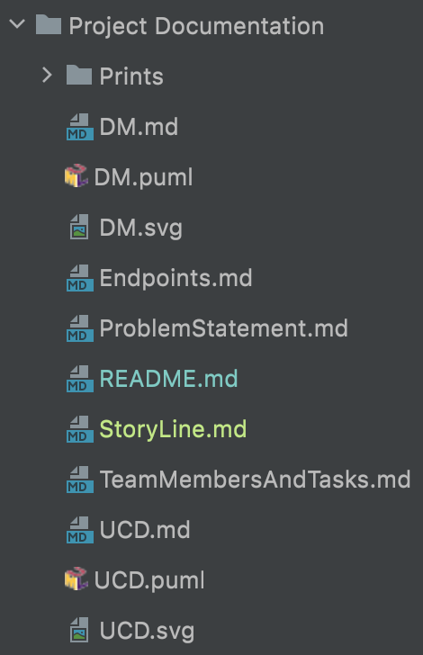
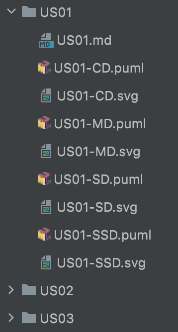
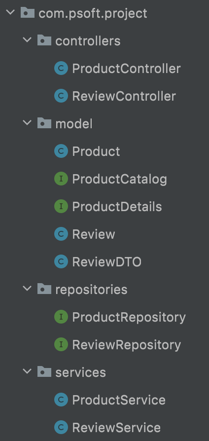
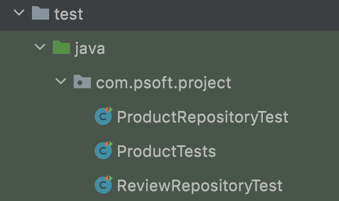
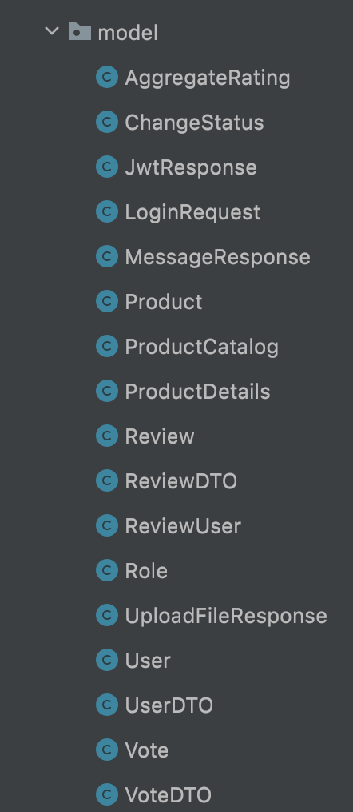
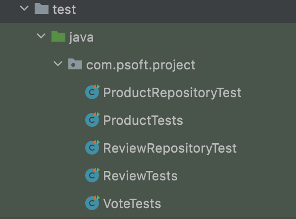

# Story Line #

We started the project by analyzing the document provided by the "Client" and writing down the topics that we thought were most important throughout it. After dividing tasks among the different members of the group, we proceeded to the development of the design. In order to have an overview of the project, we created a Model Domain, an User Case Diagram, among other things, as we can see from the following print:

For each User Case, we did a documentation of customer requirements through annotated content, we created a Class Diagram, a Model Diagram, a Sequence Diagram and a System Sequence Diagram.

 

When the design documentation was completed we started the development of the database. In relation to the same, we started by creating the entities Product and Review, in this way, it was already possible to introduce data in it.
After the development of the database, we started the creation of the API itself, which constituted the creation of controllers, services and repositories. First we started with the Products part and then Reviews as these depended on the Product.

 

In addition, we were developing some tests in order to validate the developed code.

  

The project is still under development.

--------------------------------
For the **second iteration** we created the Vote, User and Role entities and developed the rest of the code related to them.

In addition, we update the User Cases and created some more unit tests.

With this we conclude that we finished all the Work Packages including the bonus.

After the complete development of the user cases, authentication was implemented so that the user could authenticate himself and use the endpoints intended for him.
In addition, pagination has also been added that allows the user to limit the amount of elements he wants to obtain in certain User Cases.