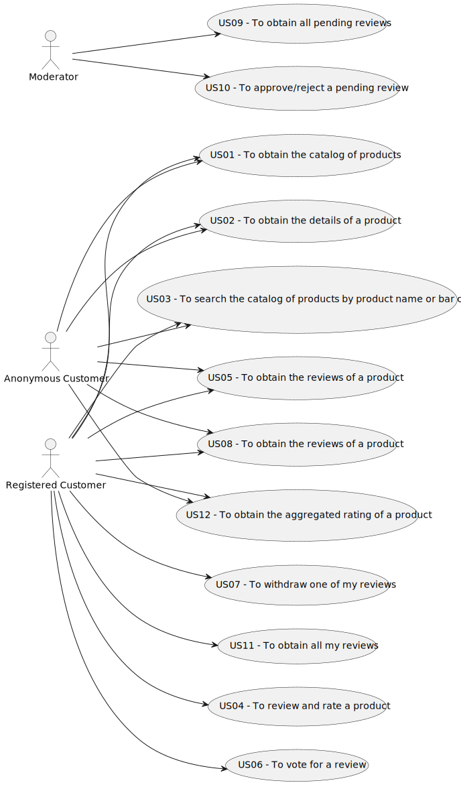

# Use Case Diagram (UCD)

# Use Cases / User Stories
| UC/US | Description                                                                      |                   
|:------|:---------------------------------------------------------------------------------|
| US01  | [To obtain the catalog of products](../US01/US01.md)                             |
| US02  | [To obtain the details of a product](../US02/US02.md)                            |
| US03  | [To search the catalog of products by product name or bar code](../US03/US03.md) |
| US04  | [To review and rate a product](../US04/US04.md)                                  |
| US05  | [To obtain the reviews of a product](../US05/US05.md)                            |
| US06  | [To vote for a review](../US06/US06.md)                                          |
| US07  | [To withdraw one of my reviews](../US07/US07.md)                                 |
| US08  | [To obtain the reviews of a product](../US08/US08.md)                            |
| US09  | [To obtain all pending reviews](../US09/US09.md)                                 |
| US10  | [To approve/reject a pending review](../US10/US10.md)                            |
| US11  | [To obtain all my reviews](../US11/US11.md)                                      |
| US12  | [To obtain the aggregated rating of a product](../US12/US12.md)                  |

