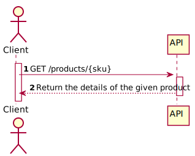
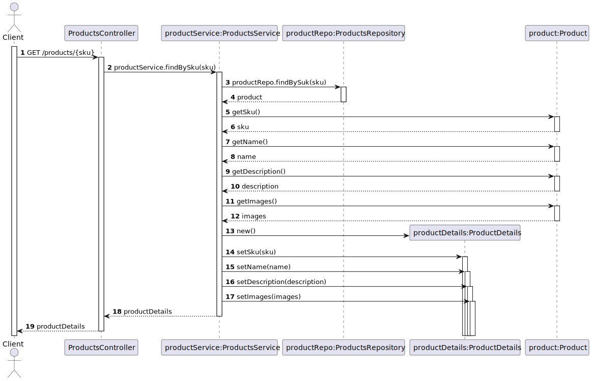
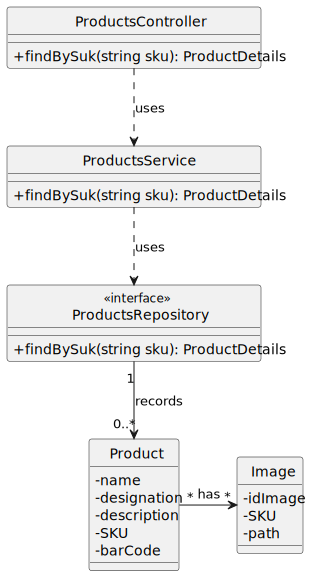

# US 02 - To obtain the details of a product

## 1. Requirements Engineering

### 1.1. User Story Description

*As anonymous or registered customer I want to obtain the details of a product.*

### 1.2. Customer Specifications and Clarifications 

**From the specifications document:**

> Products are characterized by a
designation and description as well as a set of images of the product and a SKU (Stock Keeping Unit).

 **From the client clarifications:**
> **Question:** What are the restriction of the attributes of the product?
>
> **Answer:** The sku must have 12 characters and must be alphanumeric, the name must have between 0 and 50 characters, the description must have between 0 and 1000 characters.
>
> **Question:** How is the product selected?
>  
> **Answer:** The product should be selected by its identifier number in other words its SKU.

### 1.3. Acceptance Criteria

* Analysis and design documentation;
* OpenAPI specification;
* POSTMAN collection with sample requests for all the use cases with tests;
* Products are obtained using de attribute SKU.

### 1.4. Found out Dependencies

* There must be some products in the database.

### 1.5 Input and Output Data

**Input Data:**
* Typed Data:
    * SKU

**Output Data:**
* Details of a given product.

### 1.6. System Sequence Diagram (SSD)

### 1.7 Other Relevant Remarks

## 2. OO Analysis

### 2.1. Relevant Domain Model Excerpt

### 2.2. Other Remarks

## 3. Design - User Story Realization 

## 3.1. Sequence Diagram (SD)

## 3.2. Class Diagram (CD)

# 4. Tests 

    @Test
    public void findBySku_return_product_when_found() {
        Product found = products.findBySkuProduct("cBKhdYE37I64");

        assertNotNull(found);
        assertEquals("cBKhdYE37I64", found.getSku());
    }

    @Test
    public void findBySku_return_not_found() {
        Product found = products.findBySkuProduct("Test-notExist");

        assertNull(found);
    }

