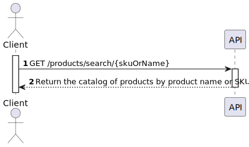
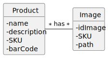
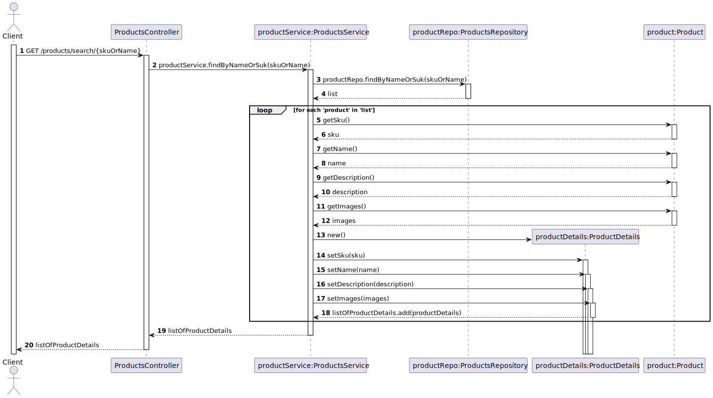
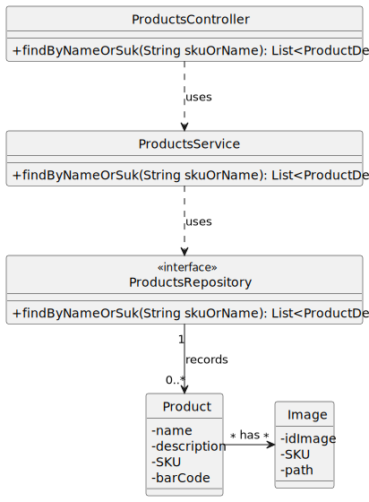

# US 03 - To search the catalog of products by product name or bar code

## 1. Requirements Engineering

### 1.1. User Story Description

*As anonymous or registered customer I want to search the catalog of products by product name
or bar code.*

### 1.2. Customer Specifications and Clarifications 

**From the specifications document:**

>Products are characterized by a
designation and description as well as a set of images of the product and a SKU (Stock Keeping Unit).

**From the client clarifications:**

> **Question:** What are the restriction of the attributes of the product?
>
> **Answer:** The sku must have 12 characters and must be alphanumeric, the name must have between 0 and 50 characters, the description must have between 0 and 1000 characters.

### 1.3. Acceptance Criteria

* Analysis and design documentation;
* OpenAPI specification;
* POSTMAN collection with sample requests for all the use cases with tests;
* The search of the catalog of products is made by inserting product name or bar code.

### 1.4. Found out Dependencies

* There must be some products in the database.

### 1.5 Input and Output Data

**Input Data:**
* Typed Data:
    * Product name or SKU

**Output Data:**
  * List of products 
    

### 1.6. System Sequence Diagram (SSD)

### 1.7 Other Relevant Remarks

## 2. OO Analysis

### 2.1. Relevant Domain Model Excerpt

### 2.2. Other Remarks

## 3. Design - User Story Realization 

## 3.1. Sequence Diagram (SD)

## 3.2. Class Diagram (CD)

# 4. Observations

Pagination has been added to the code related to this US in which the user has to insert the page and the number of elements he wants.
Pageno is the number of the page and pagesize is the number of elements that are in the page.

# 5. Tests 

    @Test
    public void findBySkuOrName_return_list_when_found() {
        List<ProductDetails> found = products.findByNameOrSku("c");

        assertNotNull(found);
        assertEquals(2, found.size());

    }

