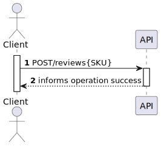

# US 04 - To review and/or rate a product

## 1. Requirements Engineering

### 1.1. User Story Description

*As registered customer I want to review and/or rate a product.*

### 1.2. Customer Specifications and Clarifications 

**From the specifications document:**
> ACME users can review an item providing a text with the review and a rating -> 0 to 5 stars, including half stars.
Reviews need to be approved by a moderator before being published.

 **From the client clarifications:**

> * Question: The User must necessarily make a review and a rate for a product? 
> 
> * Answer: No, the User can only do a review or a rate, he just cannot do any of them 
> 
> 
> * Question: What is the size of the attribute text?
>
> * Answer: 2048 characters 

### 1.3. Acceptance Criteria

* Analysis and design documentation;
* OpenAPI specification;
* POSTMAN collection with sample requests for all the use cases with tests;
* Augment the review with a funny fact about the date of publishing by using a public service, e.g., http://numbersapi.com/9/21/date.

### 1.4. Found out Dependencies

* Products must exist in the database; 
* There must be costumers registered;
* Dependencies with [US01](../US01/US01.md).

### 1.5 Input and Output Data

**Input Data:**
* Typed Data:
    * SKU (Product)
    * review
    * rating

### 1.6. System Sequence Diagram (SSD)

### 1.7 Other Relevant Remarks

## 2. OO Analysis

### 2.1. Relevant Domain Model Excerpt

## 3. Design - User Story Realization

## 3.1. Sequence Diagram (SD)

## 3.2. Class Diagram (CD)

# 4. Tests

      @Test
      public void wjdsiefhd() {
        Product product = productRepository.findBySkuProduct("iSh0kUzHCn73");

        Review review = new Review();
        review.setText("Que nojo");
        review.setRating(4);
        review.setProduct(product);
        review.setFunFact("A minha tia também acha um nojo");

        assertNotNull(review);
      }

