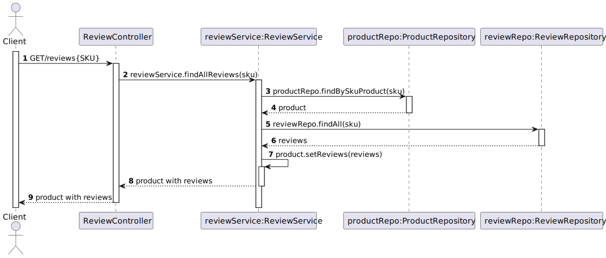

# US 05 - To obtain the reviews of a product

## 1. Requirements Engineering

### 1.1. User Story Description

*As anonymous or registered customer I want to obtain the reviews of a product. The return must be sorted in reverse chronological publishing date.*

### 1.2. Customer Specifications and Clarifications 

**From the specifications document:**

> The return must be sorted in reverse chronological publishing date.

 **From the client clarifications:**

> **Question:**  The search of the reviews of a product is made by using what attribute?
> 
> **Answer:**  Is made by using SKU

### 1.3. Acceptance Criteria

* Analysis and design documentation;
* OpenAPI specification;
* POSTMAN collection with sample requests for all the use cases with tests.
* The return must be sorted in reverse chronological publishing date.

### 1.4. Found out Dependencies

* There must exist Reviews in the database;
* There must exist Products in the database;
* Dependencies with [US01](../US01/US01.md);
* Dependencies with [US04](../US04/US04.md).

### 1.5 Input and Output Data

**Input Data:**

* Select data:
    * SKU(Product)

**Output Data:**  
  * Catalog of reviews sorted in reverse chronological publishing date.

### 1.6. System Sequence Diagram (SSD)

### 1.7 Other Relevant Remarks

## 2. OO Analysis

### 2.1. Relevant Domain Model Excerpt

## 3. Design - User Story Realization

## 3.1. Sequence Diagram (SD)

## 3.2. Class Diagram (CD)

# 4. Observations

Pagination has been added to the code related to this US in which the user has to insert the page and the number of elements he wants.
Pageno is the number of the page and pagesize is the number of elements that are in the page.

# 5. Tests 

    @Test
    public void findAllBySku_return_list_when_found() {
        Product product = productRepository.findBySkuProduct("iSh0kUzHCn73");
        List<Review> reviews =  reviewsRepository.findAll("iSh0kUzHCn73");

        assertEquals(0, reviews.size());
    }

    @Test
    public void findAllBySku2_return_list_when_found() {
        Product product = productRepository.findBySkuProduct("jdwJSJ7238B");

        assertNull(product);
    }

