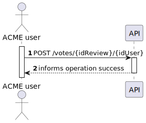
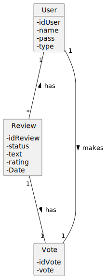
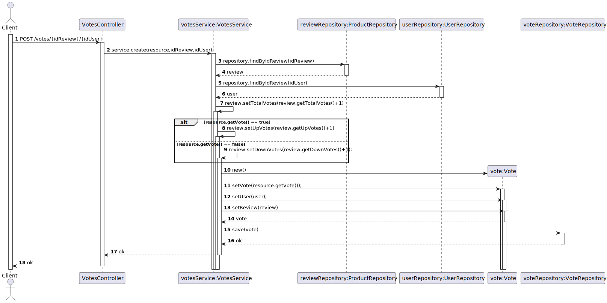
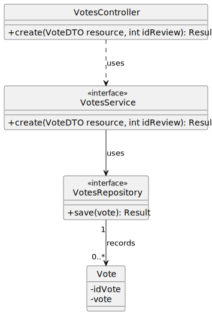

# US 06 - To vote for a review

## 1. Requirements Engineering

### 1.1. User Story Description

*As registered customer I want to vote for a review.*

### 1.2. Customer Specifications and Clarifications 

**From the specifications document:**

> ACME users can review an item providing a text with the review and a rating (0 to 5 stars, including half stars). Reviews need to be approved by a moderator before being published.

 **From the client clarifications:**

> **Question:** 
> Should review votes be presented in a single value that increases and decreases or should there be two values that would be "upVotes" and "downVotes"?
>
> **Answer:** 
> Each user can read product reviews given by other users and vote if they find the review useful or not. In this sense there are two separate "counters" for votes, "yes the review was useful" or "the review was not useful"
### 1.3. Acceptance Criteria

* Analysis and design documentation;
* OpenAPI specification;
* POSTMAN collection with sample requests for all the use cases with tests.;
* To be able to vote for a review.

### 1.4. Found out Dependencies

* There is a dependency with [US04](../US04/US04.md).

### 1.5 Input and Output Data

**Input Data:**
* Typed Data:
    * Vote
    * Review

### 1.6. System Sequence Diagram (SSD)

## 2. OO Analysis

### 2.1. Relevant Domain Model Excerpt

### 2.2. Other Remarks

## 3. Design - User Story Realization 

### 3.1. Sequence Diagram (SD)

## 3.2. Class Diagram (CD)

 
## 4. Tests
    @Test
    public void create_vote(){
        boolean status = true;
        Vote vote = new Vote(status);
        assertEquals(true, vote.isVote());

    }

