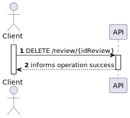
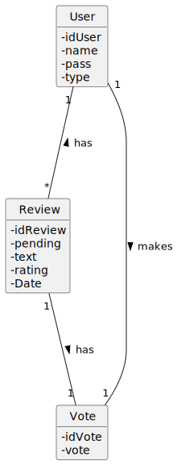
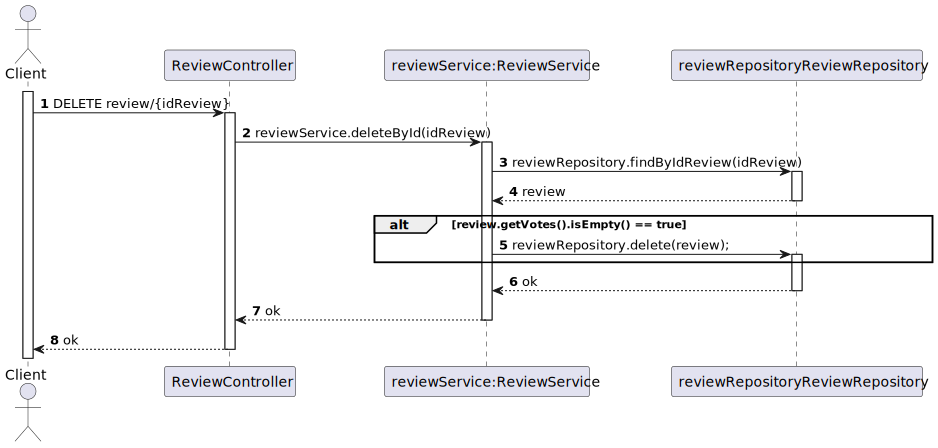
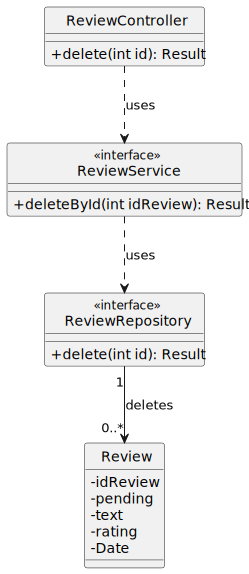

# US 07 - To withdraw one of my reviews

## 1. Requirements Engineering

### 1.1. User Story Description

*As registered customer I want to withdraw one of my reviews. Only possible if the review has no votes.*

### 1.2. Customer Specifications and Clarifications 

**From the specifications document:**

> As registered customer I want to withdraw one of my reviews. Only possible if the review has no votes.
 
**From the client clarifications:**

> **Question:** For the removal of a review to be done, we must take into account the number of votes as mentioned before in the assignment, but for this removal we must take into account both positive and negative votes, or to remove it, it is enough that it has 0 upvotes for example?
> 
> **Answer:** You can only remove a review if there are no votes ("up" or "down").

### 1.3. Acceptance Criteria

* Analysis and design documentation;
* OpenAPI specification;
* POSTMAN collection with sample requests for all the use cases with tests;
* To be able to remove a review from the API but only if they do not have any votes.

### 1.4. Found out Dependencies

* There is a dependency with [US04](../US04/US04.md).

### 1.5 Input and Output Data

**Input Data:**

* Typed Data:
    * idReview
    
### 1.6. System Sequence Diagram (SSD)

### 1.7 Other Relevant Remarks

## 2. OO Analysis

### 2.1. Relevant Domain Model Excerpt

### 2.2. Other Remarks

## 3. Design - User Story Realization 

### 3.1. Sequence Diagram (SD)

## 3.2. Class Diagram (CD)

## 4. Tests
    @Test
    public void create_review() throws IOException {
        Review review = new Review("fffff",0);
        assertEquals("fffff", review.getText());
        assertEquals(0, review.getRating());
    }
    @Test
    public void check_status() throws IOException {
        Review review = new Review("fffff",0);
        assertEquals("PENDING", review.getStatus());
    }

