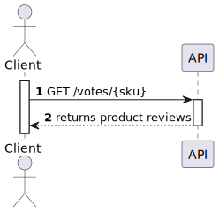
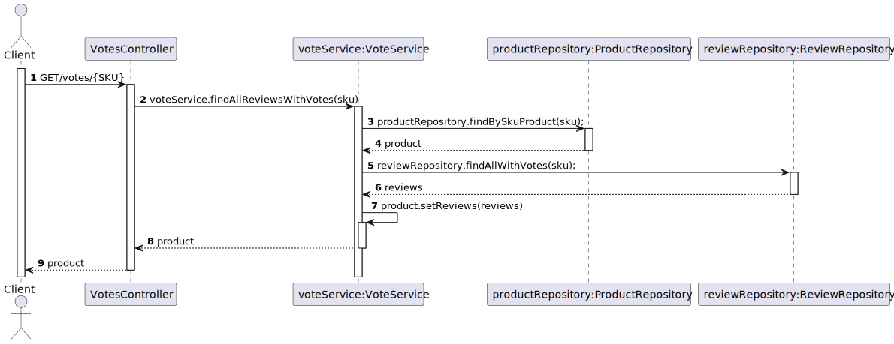
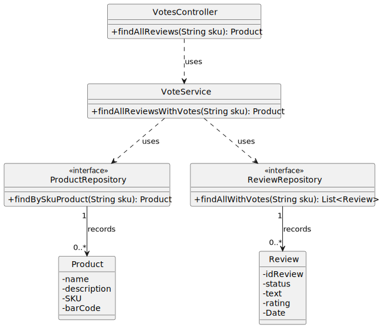

# US 08 - To obtain the reviews of a product

## 1. Requirements Engineering

### 1.1. User Story Description

*As anonymous or registered customer I want to obtain the reviews of a product, sorted by number of votes and reverse chronological publishing date.*

### 1.2. Customer Specifications and Clarifications 

**From the specifications document:**

>  Other users can check the review summary of an item (including the aggregated 5 star rating) as well as individual reviews.

### 1.3. Acceptance Criteria

* Analysis and design documentation;
* OpenAPI specification;
* POSTMAN collection with sample requests for all the use cases with tests;
* Reviews of a product must be sorted by number of votes and reverse chronological publishing date.

### 1.4. Found out Dependencies

* There is a dependency with [US05](../US05/US05.md).

### 1.5 Input and Output Data

**Input Data:**
* Typed Data:
    *  SKU (Product)

### 1.6. System Sequence Diagram (SSD)

### 1.7 Other Relevant Remarks

## 2. OO Analysis

### 2.1. Relevant Domain Model Excerpt

### 2.2. Other Remarks

## 3. Design - User Story Realization 

### 3.1. Sequence Diagram (SD)

## 3.2. Class Diagram (CD)

# 4. Observations

Pagination has been added to the code related to this US in which the user has to insert the page and the number of elements he wants.
Pageno is the number of the page and pagesize is the number of elements that are in the page.

# 5. Tests 

    @Test
    public void create_review() throws IOException {
        Review review = new Review("fffff",0);
        assertEquals("fffff", review.getText());
        assertEquals(0, review.getRating());
    }
    @Test
    public void check_status() throws IOException {
        Review review = new Review("fffff",0);
        assertEquals("PENDING", review.getStatus());
    }

