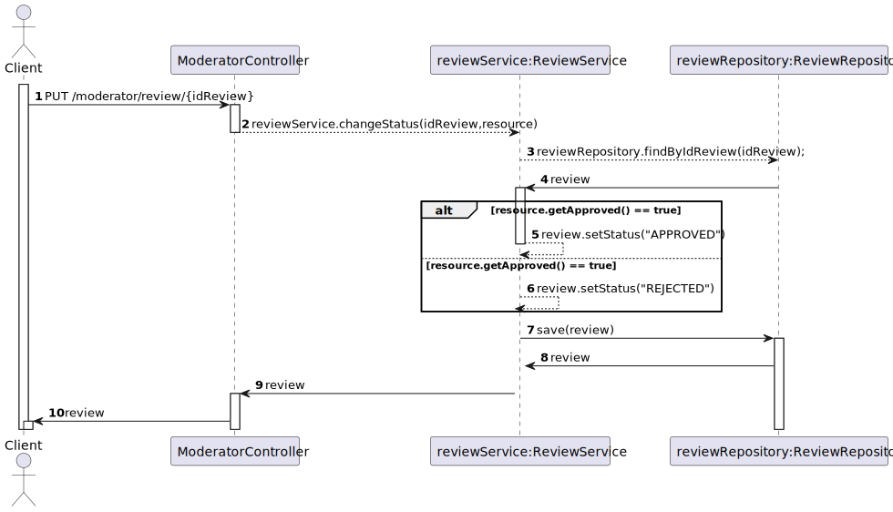

# US 10 - To approve/reject a pending review

## 1. Requirements Engineering

### 1.1. User Story Description

*As moderator, I want to approve or reject a pending review.*

### 1.2. Customer Specifications and Clarifications

**From the specifications document:**

> ACME users can review an item providing a text with the review and a rating (0 to 5 stars, including half
stars). Reviews need to be approved by a moderator before being published.

### 1.3. Acceptance Criteria

* Analysis and design documentation;
* OpenAPI specification;
* POSTMAN collection with sample requests for all the use cases with tests.

### 1.4. Found out Dependencies

* There must be pending reviews. 

### 1.5 Input and Output Data

**Input Data:**
* Typed Data:
  * Review's id
  * Status of the review

**Output Data:**
* Operation success

### 1.6. System Sequence Diagram (SSD)

### 1.7 Other Relevant Remarks

## 2. OO Analysis

### 2.1. Relevant Domain Model Excerpt

### 2.2. Other Remarks

## 3. Design - User Story Realization

## 3.1. Sequence Diagram (SD)

## 3.2. Class Diagram (CD)

# 4. Tests 
    @Test
    public void create_review() throws IOException {
        Review review = new Review("fffff",0);
        assertEquals("fffff", review.getText());
        assertEquals(0, review.getRating());
    }
    @Test
    public void check_status() throws IOException {
        Review review = new Review("fffff",0);
        assertEquals("PENDING", review.getStatus());
    }

