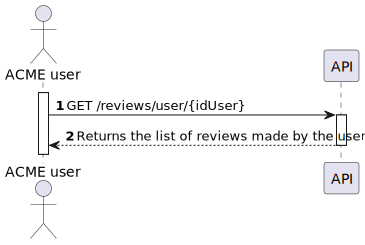
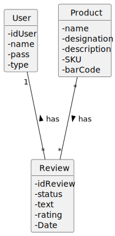
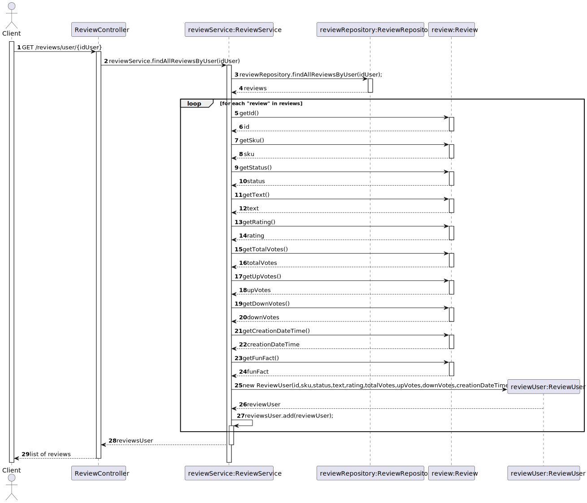
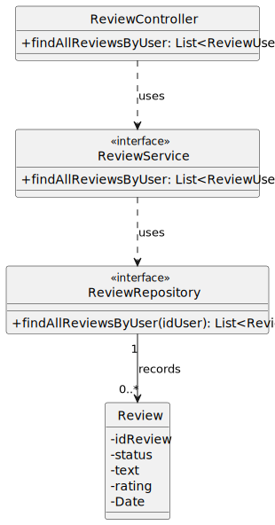

# US 11 - To obtain all my reviews

## 1. Requirements Engineering

### 1.1. User Story Description

*As registered customer I want to obtain all my reviews including their status.*

### 1.2. Customer Specifications and Clarifications

**From the specifications document:**

> ACME users can review an item providing a text with the review and a rating (0 to 5 stars, including half
stars). Reviews need to be approved by a moderator before being published.

### 1.3. Acceptance Criteria

* Analysis and design documentation;
* OpenAPI specification;
* POSTMAN collection with sample requests for all the use cases with tests.

### 1.4. Found out Dependencies

* The user must have made reviews in the pass.

### 1.5 Input and Output Data

**Output Data:**
* List of all reviews made by the given user.

### 1.6. System Sequence Diagram (SSD)

### 1.7 Other Relevant Remarks

## 2. OO Analysis

### 2.1. Relevant Domain Model Excerpt

### 2.2. Other Remarks

## 3. Design - User Story Realization

## 3.1. Sequence Diagram (SD)

## 3.2. Class Diagram (CD)

# 4. Observations

Pagination has been added to the code related to this US in which the user has to insert the page and the number of elements he wants.
Pageno is the number of the page and pagesize is the number of elements that are in the page.

# 5. Tests 

    @Test
    public void create_review() throws IOException {
        Review review = new Review("fffff",0);
        assertEquals("fffff", review.getText());
        assertEquals(0, review.getRating());
    }
    @Test
    public void check_status() throws IOException {
        Review review = new Review("fffff",0);
        assertEquals("PENDING", review.getStatus());
    }

