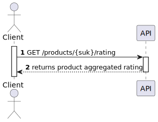
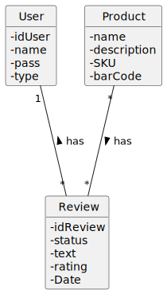
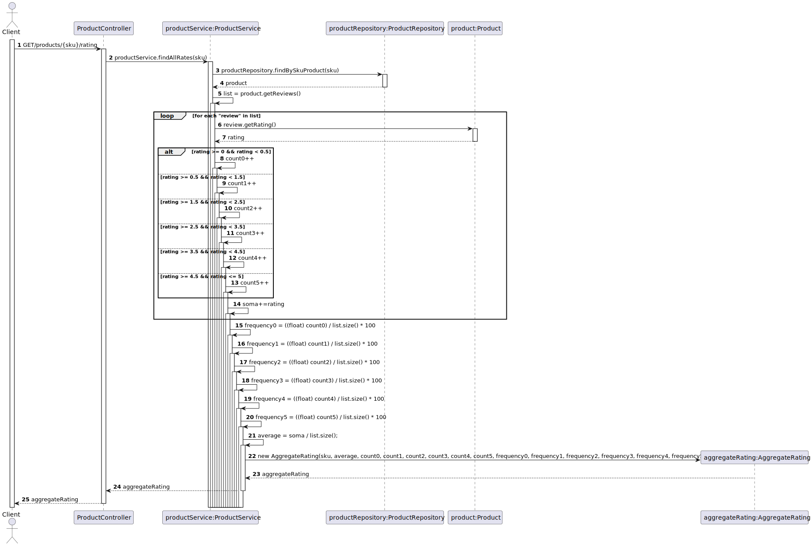
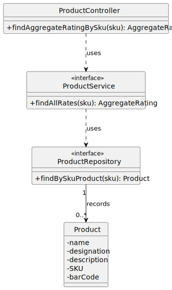

# US 12 - To obtain the aggregated rating of a product

## 1. Requirements Engineering

### 1.1. User Story Description

*As anonymous or registered customer I want to obtain the aggregated rating of a product.*

### 1.2. Customer Specifications and Clarifications 

**From the specifications document:**

> Besides individual reviews and ratings, a product has an aggregated rating based on the weighted average of all the ratings. Details of the aggregated rating is in the form of a frequency table (the frequency of votes per star).

### 1.3. Acceptance Criteria

* To be able to get the aggregated rating of a product.

### 1.4. Found out Dependencies

* There is a dependency with [US08](../US08/US08.md).

### 1.5 Input and Output Data

**Input Data:**
* Typed Data:
    * Product SKU
    

### 1.6. System Sequence Diagram (SSD)

### 1.7 Other Relevant Remarks

## 2. OO Analysis

### 2.1. Relevant Domain Model Excerpt

### 2.2. Other Remarks

## 3. Design - User Story Realization 

### 3.1. Sequence Diagram (SD)

## 3.2. Class Diagram (CD)

# 4. Tests 

    @Test
    public void create_review() throws IOException {
        Review review = new Review("fffff",0);
        assertEquals("fffff", review.getText());
        assertEquals(0, review.getRating());
    }
    @Test
    public void check_status() throws IOException {
        Review review = new Review("fffff",0);
        assertEquals("PENDING", review.getStatus());
    }

